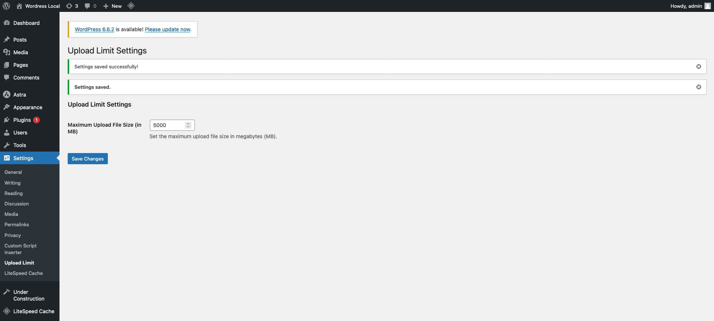

# Custom Upload Limits

**Version:** 1.0  
**Author:** [Janlord Luga](https://janlordluga.com/)  
**License:** GPL-2.0+  
**Tags:** upload, limits, file size, WordPress  
**Requires at least:** 5.0  
**Tested up to:** 6.0  
**Stable tag:** 1.0

## Description

Custom Upload Limits is a simple WordPress plugin that allows administrators to set the maximum upload file size directly from the admin settings panel. With this plugin, you can easily control the maximum upload file size without needing to modify server configurations manually.

## Features

- Admin setting to adjust the maximum upload file size (in megabytes).
- Default maximum upload file size set to 10MB.
- Automatically applies limits to `upload_max_filesize` and `post_max_size` in PHP.
- Easy-to-use interface in the WordPress dashboard under **Settings > Upload Limit**.

## Installation

1. **Download or Clone this Repository**:
    - Clone: `git clone https://github.com/janlord01/custom-upload-limits.git`
    - Or download the ZIP file from GitHub and unzip it in your `/wp-content/plugins/` directory.

2. **Activate the Plugin**:
    - Go to the WordPress admin dashboard.
    - Navigate to **Plugins > Installed Plugins**.
    - Find **Custom Upload Limits** and click **Activate**.

3. **Set the Upload Limit**:
    - After activation, go to **Settings > Upload Limit**.
    - Adjust the maximum upload size in megabytes (MB) and save your settings.

## Usage

- The default upload limit is set to 10MB.
- You can adjust the upload limit at any time via the WordPress admin settings page.
- The plugin automatically updates the maximum file size in both WordPress and the PHP settings (`upload_max_filesize` and `post_max_size`).

## Screenshots

1. **Settings Page**  
   

## Changelog

### 1.0
- Initial release of Custom Upload Limits.
- Added admin setting for controlling the maximum upload file size.

## License

This plugin is licensed under the GPLv2 or later. You can find a copy of the license in the `LICENSE` file included with this plugin.

## Contributing

Feel free to submit a pull request or open an issue for any improvements or bug fixes.

---

**Author:** [Janlord Luga](https://janlordluga.com/)  
[GitHub](https://github.com/janlord01) | [Website](https://janlordluga.com/)
